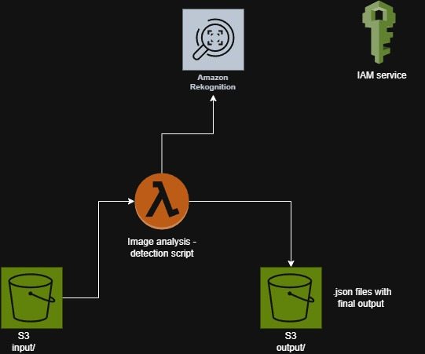

# AWS-ImageRekognition

This project uses AWS Rekognition to automatically analyze images uploaded to an S3 bucket. It uses S3, Lambda, and IAM to create an event-driven image processing workflow.

---

## 1. IAM Role Configuration 

To run the script, create a role using **Identity and Access Management (IAM)**.

### Steps:

1. Go to the **IAM** console.
2. Create a new role, e.g., `lambda-execution-role`.
3. Attach the following policies:
   - `AmazonRekognitionFullAccess`
   - `AmazonS3FullAccess`
   - `AWSLambda_FullAccess`

---

## 2. S3 Bucket Setup

Create a new S3 bucket with a **globally unique name**.

### Folder Structure:

Inside your bucket, create two folders:
- input/
- output/

### Enable Event Notifications:

1. Go to your bucket's **Properties** tab.
2. Scroll down to **Event notifications** and click **Create event notification**.
3. Configure as follows:
   - **Prefix (optional):** `input/`
   - **Suffix (optional):** `.jpg` (or any file type you want to trigger the Lambda)
   - **Event Types:** `PUT` (i.e., `s3:ObjectCreated:Put`)

This will trigger a Lambda function when a `.jpg` file is uploaded to the `input/` folder.

---

## 3. Lambda Function Setup

1. Go to the **Lambda** service in the AWS Console.
2. Click **Create function**.
   - Runtime: `Python 3.12`
   - Permissions: **Use an existing role** — select the `lambda-execution-role` created earlier.
3. In the **Code Source** section, paste the contents of your `index.py`.
4. Scroll down to **Runtime settings** and:
   - Click **Edit**
   - Set **Handler** to: `index.lambda_handler`
   - Click **Save**

### Add S3 Trigger:

1. At the top of the Lambda function page, click **+ Add trigger**.
2. Choose **S3** as the source.
3. Select your bucket.
4. Set the prefix to `input/` and suffix to `.jpg` (to match your event notification).
5. Save the trigger.

---

## ✅ Done!

Now, when you upload a `.jpg` file to the `input/` folder in your S3 bucket, the Lambda function will automatically be triggered and process the image using AWS Rekognition.
